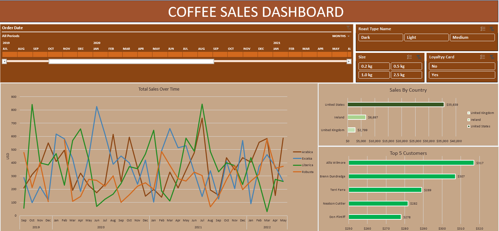

# Coffee Sales Dashboard

This Coffee Sales Dashboard is an interactive excel dashboard that provides insights into coffee sales across different regions, customer types, and coffee varieties. It allows users to explore sales trends over time, as well as identify top-selling coffee types and loyal customers.

## Dashboard Overview

### Key Features:
1. **Order Date Filter**: Select the date range to view sales for specific periods.
2. **Roast Type Name**: Filter by roast types, including Dark, Light, and Medium.
3. **Size**: Filter by coffee package size (e.g., 0.2 kg, 0.5 kg, 1.0 kg, 2.5 kg).
4. **Loyalty Card**: Filter customers based on loyalty card ownership.
5. **Total Sales Over Time**: View the overall coffee sales performance across different coffee types (Arabica, Excelsa, Liberica, Robusta) on a time series chart.
6. **Sales by Country**: Analyze sales by country, showing how much coffee was sold in the United States, Ireland, and the United Kingdom.
7. **Top 5 Customers**: Display the top 5 customers with the highest sales.

## Excel Techniques Used
In preparing the data for this dashboard, the following Excel techniques were applied:

- **XLOOKUP**: To perform efficient lookups between datasets.
- **INDEX MATCH**: Used to retrieve values from specific rows and columns.
- **Multiplication Formula for Sales**: Calculated total sales by multiplying quantity and price.
- **Date Formatting**: Standardized date formats across the dataset.
- **Number Formatting**: Applied for currency and numerical data representation.
- **Check for Duplicates**: Ensured no duplicate entries were present in the dataset.
- **Convert Range to Table**: Structured data into tables for better manipulation and visualization.
- **Pivot Tables and Pivot Charts**: Summarized data into meaningful insights for dashboard creation.
- **Insert Timeline + Formatting**: Created timelines for filtering data over specific periods.
- **Insert Slicers + Formatting**: Used slicers for interactive data filtering.
- **Updating the Pivot Table Data Source**: Dynamically updated data sources as new data was added.
- **Building the Dashboard**: Compiled insights into a visually appealing dashboard.

## Data Source
- The dashboard is based on the sales data of various coffee products. The data includes the following details:
  - **Order Date**
  - **Coffee Type** (Arabica, Excelsa, Liberica, Robusta)
  - **Roast Type** (Dark, Light, Medium)
  - **Customer Location** (Country)
  - **Order Size** (0.2 kg, 0.5 kg, 1.0 kg, 2.5 kg)
  - **Loyalty Card** (Yes/No)

## How to Use
1. **Select Time Period**: Use the date slider to adjust the time period and view sales over months or years.
2. **Filter by Roast Type**: Use the filters for roast type, size, and loyalty card to view sales for specific categories.
3. **Analyze Sales**: Explore the charts for sales by country and top customers to understand where most sales are coming from and who the top buyers are.
4. **Track Trends**: Use the "Total Sales Over Time" graph to monitor how sales of different coffee types have fluctuated over the selected period.

## Conclusion
This Coffee Sales Dashboard allows for deep insights into coffee sales trends, helping businesses understand customer preferences, identify top-selling products, and make data-driven decisions. With detailed filtering options, users can easily drill down into the data to find specific insights based on roast type, size, and customer loyalty.

---

**Created by**: Shudi Zhao
**Date**: September 8, 2024
